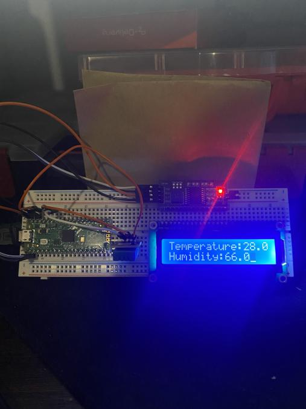

# RPI-Pico-Thermometer
Raspberry pi pico connected to DHT11 Sensor displaying data on an LCD screen

dht.py , lcd_api.py , pico_i2c_lcd.py are public and not written by me they have to be loaded onto the pico or else 
